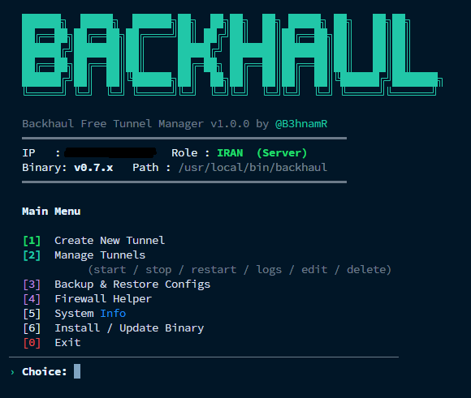

# BackhaulManager

Modern terminal manager for creating and operating [Backhaul](https://github.com/Musixal/Backhaul) tunnels with a clean interactive workflow.

Join the Telegram channel for updates, notes, and more BackhaulManager content: [@B3hnamR](https://t.me/B3hnamR)



## Highlights

- Interactive Iran/Kharej role selection with auto-detection
- One-command Backhaul binary install/update flow
- Guided tunnel creation for `tcp`, `tcpmux`, `wsmux`, and `wssmux`
- Preset and advanced tuning modes for production-style configs
- Systemd service generation, start/stop/restart, live logs, and deletion
- Config backup/restore and firewall helper for UFW or iptables
- Built-in two-way link test for ping and TCP reachability checks
- WSSMUX TLS certificate generation with OpenSSL
- **Auto-restart via cron** — schedule periodic tunnel restarts to clear cache and maintain speed
- **Web Panel** — beautiful web interface to manage tunnels from your browser

## Requirements

- Linux server with `systemd`
- Root access (or user with passwordless sudo)
- `bash`, `curl` or `wget`, `tar`
- Optional: `ufw`, `iptables`, `openssl`
- For SSH password auth: `sshpass` (install with `apt install sshpass` or `yum install sshpass`)

**Note for non-root users (e.g., Ubuntu on Abrarvan):**
If your server user is not `root`, make sure the user has passwordless sudo access:
```bash
sudo usermod -aG sudo your_username
echo "your_username ALL=(ALL) NOPASSWD:ALL" | sudo tee /etc/sudoers.d/your_username
```

## Quick Start

**One-line install & run (copy & paste on your server):**

```bash
bash <(curl -Ls https://raw.githubusercontent.com/emad1381/BackhaulManager/master/backhaul-manager.sh)
```

Or with `wget`:

```bash
bash <(wget -qO- https://raw.githubusercontent.com/emad1381/BackhaulManager/master/backhaul-manager.sh)
```

**Manual run:**

```bash
chmod +x backhaul-manager.sh
sudo ./backhaul-manager.sh
```

Use **Install / Update Binary** first if Backhaul is not installed yet, then create a tunnel from the main menu.

## Recommended Setup

For the best default experience, choose **WSSMUX** as the tunnel transport and use **Preset** mode for tuning parameters.

## Typical Workflow

1. Run the script on the Iran server and choose `IRAN`.
2. Create a tunnel and copy the generated transport, port, and token.
3. Run the script on the Kharej server and choose `KHAREJ`.
4. Create the matching tunnel using the Iran server address and the same token.
5. Use **Manage Tunnels** to inspect status, follow logs, restart, edit, or delete services.

## Auto-Restart (Cron)

Schedule periodic tunnel restarts to clear cache and maintain optimal speed:

1. Go to **Manage Tunnels** → Select a tunnel → **Schedule Auto-Restart**
2. Choose an interval (30 min, 1 hour, 2 hours, 6 hours, or custom)
3. The cron job will automatically restart the tunnel at the specified interval

**Note:** The tunnel will briefly disconnect during restart. This is normal behavior.

## Web Panel

Beautiful web interface to manage **both Iran and Kharej servers** from one place:

1. Run the script and select **[3] Web Panel**
2. Choose **[4] Install / Update** to download the web panel files
3. On first install you'll be guided through the secure setup wizard
   (**[7] Configure** lets you re-run it anytime):
   - **Panel port** — choose any port (default `54321`)
   - **Admin username & password** — the password is stored only as a salted
     PBKDF2-SHA256 hash, never in plain text
   - **HTTPS** — put the panel behind a domain and get a free Let's Encrypt
     certificate, or use a self-signed certificate
4. Choose **[1] Start** to launch the panel
5. Open the URL shown by the script (e.g. `https://your-domain:PORT`) in your browser
6. Login with the username and password you set during configuration

> Security tip: always enable HTTPS and set a strong password. Over plain HTTP
> your login and SSH credentials are sent in clear text.

### Putting the panel behind a domain (free HTTPS)

In **[7] Configure**, answer **y** to the domain question, then enter a domain
whose DNS A record already points to this server. The script installs
`certbot`, obtains a Let's Encrypt certificate via the HTTP-01 challenge
(TCP/80 must be reachable), wires it into the panel, and installs a renewal
hook that restarts the panel automatically when the certificate is renewed.

**Features:**
- **HTTPS / TLS** — Let's Encrypt (domain) or self-signed certificates
- **Hashed credentials** — admin password stored as a PBKDF2-SHA256 hash
- **Hardened sessions** — `HttpOnly`, `SameSite=Lax`, `Secure` (on HTTPS) cookies with expiry
- **Multi-Server Management** — add Iran + Kharej servers, manage from one dashboard
- **One-Click Tunnel Creation** — create matching tunnel on both servers simultaneously
- **SSH Password & Key Auth** — connect with password or SSH key, custom SSH port
- Beautiful dashboard with server status cards
- Create, start, stop, restart, and delete tunnels
- View live logs and edit config files
- Schedule auto-restart (cron) for each tunnel
- Install/update Backhaul binary on any server
- SSH connection to manage remote servers
- Responsive design works on mobile too

To run as a service (auto-start on boot), select **[3] Start on boot**.

## Notes

- Generated configs are stored in `/etc/backhaul`.
- Services are created as `backhaul-<role>-<transport>-<port>.service`.
- Existing configs are backed up before overwrite/edit/delete operations.
- For WSSMUX, the script can generate a self-signed TLS certificate automatically.
- Cron configs for auto-restart are stored in `/etc/backhaul/cron/`.
- Web Panel runtime settings are stored in `/etc/backhaul/webpanel/panel_config.json`
  and credentials in `settings.json` (both `chmod 600`, root-only).

## Security

- The Web Panel can serve over **HTTPS** using a Let's Encrypt certificate
  (when bound to a domain) or a self-signed certificate.
- The admin password is stored as a **salted PBKDF2-HMAC-SHA256 hash**, never
  in plain text.
- Session cookies use `HttpOnly`, `SameSite=Lax`, the `Secure` flag (over
  HTTPS), and expire after 12 hours.
- Files containing credentials (`settings.json`, `servers.json`,
  `panel_config.json`) are written with `0600` permissions.
- Always change the default password and enable HTTPS before exposing the
  panel to the internet.

## License

Released under the [MIT License](LICENSE). © 2026 emad1381.
